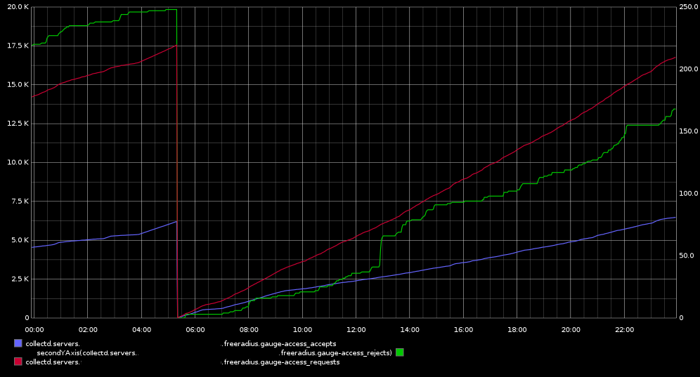

# collectd-freeradius
Collectd [python plugin](https://collectd.org/wiki/index.php/Plugin:Python) to gather freeradius stats


Enable freeradius stats: http://wiki.freeradius.org/config/Status

Plugin uses subprocess to execute radclient. Timeout is 1 second.


To enable:
```
sudo cp freeradius.py /usr/lib/collectd/plugins/python
```

And available configuration options:

```
<LoadPlugin python>
    Globals true
</LoadPlugin>
<Plugin python>
    ModulePath "/usr/lib/collectd/plugins/python"
    Import "freeradius"
    <Module freeradius>
        Statistics_Type 1
        Host localhost
        Port 18121
        Secret adminsecret
    </Module>
</Plugin>
```

Screenshot:

